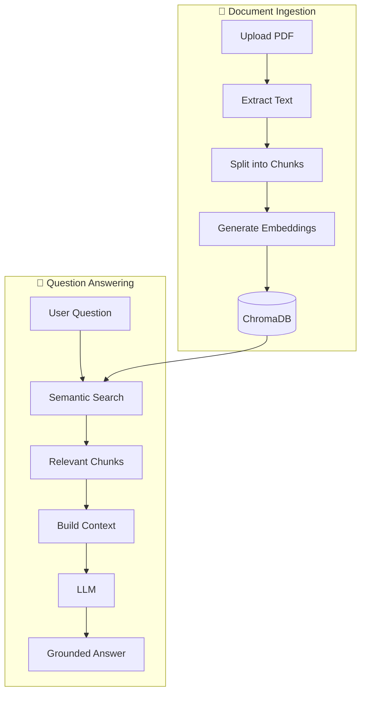
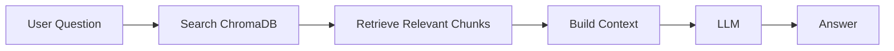

# AI-doc-agent

# Overview
AI Doc Agent is a document question-answering application that allows users to upload PDF documents and ask natural-language questions about their contents.

The application uses Retrieval-Augmented Generation (RAG) to retrieve relevant document sections and generate grounded answers using an LLM.

# Features

- PDF document upload
- Document text extraction
- Automatic document chunking
- Vector embeddings
- Semantic similarity search
- Retrieval-Augmented Generation
- Source/page references
- FastAPI backend
- Streamlit frontend

# Architecture
                         ┌──────────────────────┐
                         │      USER / BROWSER   │
                         └──────────┬───────────┘
                                    │
                                    ▼
                         ┌──────────────────────┐
                         │      STREAMLIT UI    │
                         │       Frontend       │
                         └──────────┬───────────┘
                                    │ HTTP
                                    ▼
                         ┌──────────────────────┐
                         │       FASTAPI        │
                         │        Backend       │
                         └──────────┬───────────┘
                                    │
                         ┌──────────┴──────────┐
                         │                     │
                         ▼                     ▼
                  ┌─────────────┐       ┌─────────────┐
                  │   RAG       │       │  Document   │
                  │  Pipeline   │       │  Processing │
                  └──────┬──────┘       └──────┬──────┘
                         │                     │
                         ▼                     ▼
                  ┌─────────────┐       ┌─────────────┐
                  │  ChromaDB   │       │    PDFs     │
                  └──────┬──────┘       └─────────────┘
                         │
                         ▼
                  ┌─────────────┐
                  │  AI Model   │
                  │   / LLM     │
                  └─────────────┘
# Tech Stack

Frontend
- Streamlit

Backend
- FastAPI
- Uvicorn

AI / RAG
- LangChain
- ChromaDB
- Ollama
- Qwen 2.5
- nomic-embed-text

Document Processing
- PyPDFLoader
- RecursiveCharacterTextSplitter

## Project Structure

```text
AI-doc-agent/
├── backend/
│   ├── main.py
│   ├── rag/
│   │   ├── ingest.py
│   │   ├── vectorstore.py
│   │   ├── retrieve.py
│   │   ├── generator.py
│   │   └── pipeline.py
│   ├── data/
│   └── chroma_db/
│
├── frontend/
│   └── app.py
│
├── requirements.txt
├── README.md
├── LICENSE
└── .gitignore

## How RAG Works

AI Doc Agent uses **Retrieval-Augmented Generation (RAG)** to answer questions based on the contents of uploaded documents.



### The process

**1. Ingest the document**

The uploaded PDF is converted into text, split into smaller chunks, and transformed into vector embeddings. These embeddings are stored in ChromaDB.

**2. Retrieve relevant information**

When a user asks a question, the system performs a semantic search against ChromaDB and retrieves the most relevant document chunks.

**3. Generate the answer**

The retrieved chunks are used as context for the LLM. The model generates an answer based on that context rather than relying solely on its general knowledge.

### Question Answering



The process works in two stages:

1. **Document ingestion** — The PDF is loaded, split into chunks, converted into embeddings, and stored in ChromaDB.
2. **Question answering** — The user's question is used to find relevant chunks in ChromaDB. Those chunks are provided to the LLM as context to generate the answer.


# Local Setup
1. Clone the repository
 git clone <>
 cd AI-doc-agent

2. Create a virtual environment and activate it from gitbash
python -m venv venv
source venv/Scripts/activate

3. Install dependencies
pip install -r requirements.txt

4. Install and run Ollama
The project currently uses Ollama for local model inference.

Required models:
ollama pull qwen2.5:7b
ollama pull nomic-embed-text

# API Endpoints
Running the Backend

Navigate to the backend directory:
cd backend

Start FastAPI:uvicorn main:app --reload
The API will be available at:http://127.0.0.1:8000

# Future Improvements

- Support multiple document uploads
- Add document management and deletion
- Improve source citations and document references
- Add better error handling and validation
- Add automated tests
- Add RAG evaluation to measure answer quality
- Add authentication and user management
- Use persistent production-ready vector storage
- Support hosted LLMs for deployment
- Add monitoring and observability
- Deploy the application to production

# License

This project is licensed under the apache License.